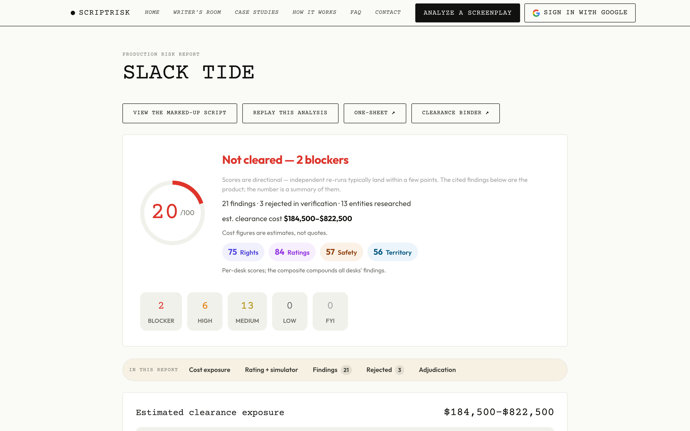
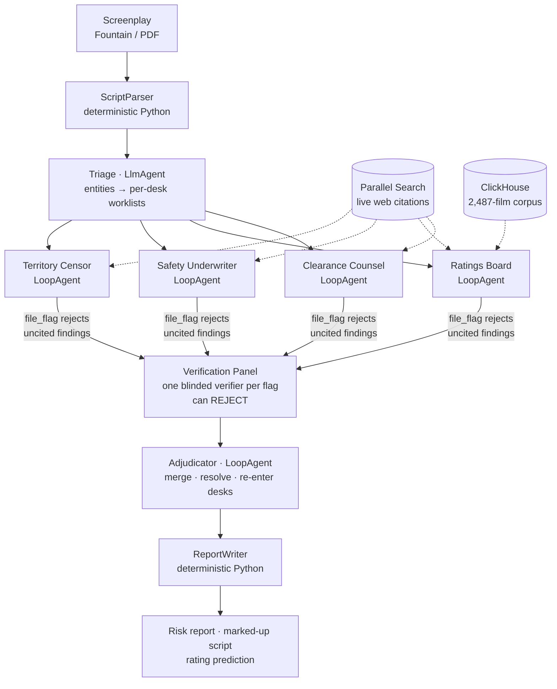

# ScriptRisk

**Multi-agent screenplay clearance and production-risk analysis.**
*(repo codename: greenlight — the product is ScriptRisk; its score kept the old name)*
Live at **[scriptrisk.com](https://scriptrisk.com)** · built for the Agentic Cinema hackathon, Parallel track.



Before a single frame is shot, a studio spends weeks clearing a screenplay: four separate desks —
rights counsel, the ratings board, the safety underwriter, and territory censors — each read the
same script looking for different ways it will cost money or fail to release. The work is manual,
serial, and expensive; independent producers mostly can't afford it at all.

ScriptRisk runs those four desks concurrently as agents. Every finding it returns carries a
**verbatim citation**, a concrete remedy, and a cost estimate — and an independent verifier
re-reads every citation and **rejects** findings the source does not support. The rejection shows
up in the report, with the reason.

> **The one non-negotiable rule:** a finding without a citation does not render. It is enforced
> in the `file_flag` tool's schema validation, not requested in a prompt.

## Architecture



The four desks run concurrently (`ParallelAgent`); each is a `LoopAgent` deciding for itself
what to investigate and when to stop. Gemini judges; Parallel retrieves the outside world;
ClickHouse holds the comparison set — the model never asserts what a tool can retrieve.

## What it produces

- A **Production Risk Report** — severity-ranked findings, each cited, each with a remedy and a
  rule-of-thumb cost range; a deterministic **Greenlight Score**; honest open questions.
- An **MPA rating prediction with evidence** — your script's content profile against a corpus of
  2,487 released films: "7 of your 8 nearest comparables are rated R," plus the exact beats to
  cut for your target rating.
- A **marked-up script** — every finding anchored to its scene by character offsets, both ways.
- The **What-If rating simulator** — check cuts and the *actual evidence pipeline* re-runs
  (profile rewritten, re-embedded, re-searched against the corpus). It will honestly push back
  on its own cut list when the remaining content still patterns higher.
- **Production artifacts** — the standard studio **Clearance Binder** (PDF/CSV), a one-sheet
  PDF, and accepted fixes exported as revised `.fountain` or Final Draft `.fdx` with revision
  marks.
- The **Writer's Room** — professional-style coverage (PASS/CONSIDER/RECOMMEND), a pitch package
  whose comparables are *retrieved* from the corpus with sources (never invented), and a
  deterministic format & readiness check.

## Architecture

```
GreenlightPipeline                  SequentialAgent (Google ADK)
├── ScriptParser                    deterministic Python — Fountain/PDF -> Scene[]
├── Triage                          LlmAgent (Gemini Flash) -> Entity[] + per-desk worklists
├── GatekeeperPanel                 ParallelAgent — four desks, concurrent
│   ├── ClearanceCounsel            LoopAgent — rights, music ownership chains
│   ├── RatingsBoard                LoopAgent — rating drivers + kNN comparables (ClickHouse)
│   ├── SafetyUnderwriter           LoopAgent — stunts, pyro, water, minors, animals
│   └── TerritoryCensor             LoopAgent — US / UK / CN / UAE
├── VerificationPanel               one blinded verifier per filed flag; can REJECT
├── Adjudicator                     LlmAgent (Gemini Pro) — merge, normalize, resolve conflicts
└── ReportWriter                    deterministic Python -> Report + marked-up script
```

Each desk is a genuine research loop: nine tools (`read_scene`, `find_in_script`, `research`,
`fetch_page`, `deep_research`, `query_precedent`, `file_flag`, `note_open_question`, `done`),
its own budget, and the freedom to decide what to chase and when to stop. The web side is
**three Parallel APIs**, used the way a real clearance clerk escalates:

- **Search** (`research()`) — every desk's default instrument, `mode="advanced"`, one
  session per run so Parallel keeps context across a chained ownership chase. The Territory
  desk geo-targets its searches (`location="CN"` — it searches *from* the territory), and
  registry checks pin the allowlist to the authority itself (`uspto.gov`, `copyright.gov`,
  ASCAP/BMI/SESAC repertories).
- **Extract** (`fetch_page()`) — when a search result names the right page (a PRO repertory
  entry, a court opinion, a regulator's guidelines) but the excerpt is too thin to cite, the
  desk pulls the full page and cites the operative language verbatim.
- **Task API** (`deep_research()`) — the escalation of last resort: a slow, multi-source
  investigation for ownership chains that decide a BLOCKER and that two searches couldn't
  crack. Capped at 2 per desk per run; its citations enter the same provenance registry, so
  its findings face the same verbatim-excerpt gate as everything else.

Verifiers are blinded to the desks' reasoning; the adjudicator's merge
plan is applied deterministically with guards. Governing principle throughout: **never let the
model assert what you could retrieve.**

## Runtime stack

| Piece | Technology |
|---|---|
| Agents | **Google ADK** (`google-adk`) on **Vertex AI Gemini** — Flash for the desks, Pro for adjudication & coverage |
| Live web research / citations | **Parallel Search + Extract + Task APIs** (`parallel-web`) |
| Ratings corpus (2,487 films) | **ClickHouse Cloud** kNN over `text-embedding-005` embeddings; facts from Wikidata (CC0) + Wikipedia via official APIs, every row with a source URL |
| Web app | FastAPI + SSE on **Cloud Run**, vanilla JS + GSAP (vendored) |

No AI SDK other than Google's is used at runtime — enforced by `scripts/check_forbidden_deps.sh`
on every build (`make check`).

## Run it

```bash
git clone https://github.com/lalitlouis/greenlight.git
cd greenlight
make install
make serve          # -> http://localhost:8080
```

**No credentials needed** to explore: the site ships with a recorded analysis — click *Watch a
recorded analysis* (or *See an example report* in the Writer's Room). Live analyses need a `.env`
with `GOOGLE_CLOUD_PROJECT` (Vertex AI enabled), `PARALLEL_API_KEY`, and `CLICKHOUSE_*`.

```bash
make run            # clearance pipeline on the fixture screenplay (live APIs)
make test           # 53 tests, no network
make eval           # score the newest run against the seeded ground truth
make check          # lint + forbidden-dependency scan
python -m greenlight.cli write fixtures/slack_tide.fountain   # Writer's Room, CLI
```

The fixture screenplay, *Slack Tide*, is an original short film written for this project and
deliberately seeded with one instance of every flag category — plus two traps designed to be
wrongly flagged so the verifier has something real to reject (`fixtures/SEEDS.md` is the ground
truth; `make eval` executes it).

## Repository

```
src/greenlight/         agents/, tools/, writer/, parser, pipeline, server, report
schemas/                frozen JSON contracts: scene, entity, flag, report
fixtures/               Slack Tide + seed map + cached API cassettes
runs/*_demo.json        the recorded analyses the demo replays
scripts/                corpus ingest, eval harness, compliance scan
docs/                   PRD, TECH_SPEC, STATUS, DEMO, DATA_SOURCES, ...
```

MIT licensed. Cost figures are rule-of-thumb estimates, not quotes; ScriptRisk is a research
tool, not legal advice.
